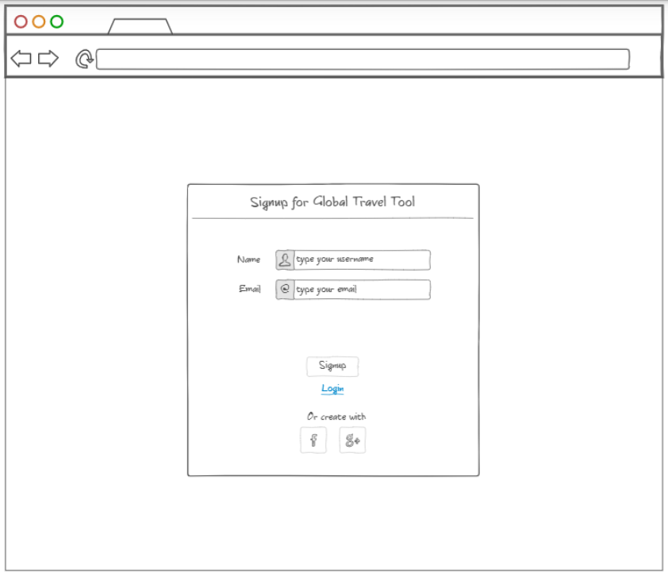
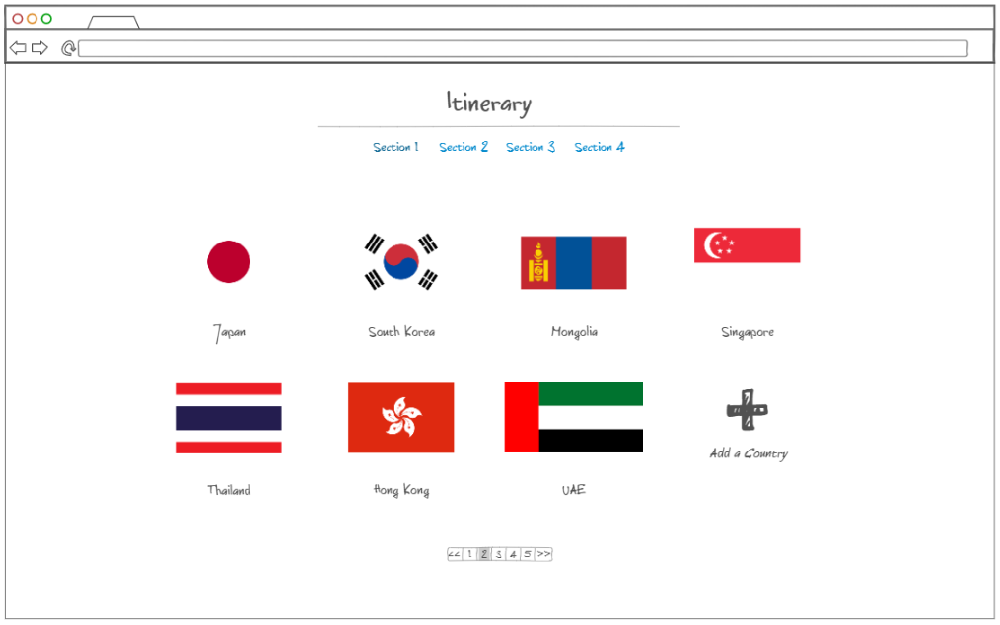

# Startup
CS260

Notes can be found [here](https://github.com/bwegr/startup/blob/main/notes.md)

# Global Traveler Tool

## Specification Deliverable

### Elevator pitch

Have you ever traveled to a new country and spent countless hours preparing for the trip? Have you ever gotten to that country and realized that, even with those hours  of research, you were unprepared for something? Figuring out the type of currency you need, visas, vaccines, electrical adapters, etc. can be so time-consuming and arduous! The Global Traveler Tool allows you to get the critical info you need about the countries you are traveling to all in one place in the blink of an eye. Users can search countries one by one or create custom itineraries with any number of countries and get essential information in a concise and direct form to ensure their international travel, no matter how complex, will go smoothly.

### Design
Here is how the login page would look:

Here is how the itinerary page would look:

### Key features

- Secure login over HTTPS
- Ability to search any country and receive a page of travel-relevant information
- Itinerary Page which allows you to create an itinerary with multiple countries
- Travel info page (following creation of itinerary) that has a report for the entire intinerary
- Real-time information pulled on travelling safety from US State Department
- Ability to save and store multiple itineraries for each user
- Itineraries are updated in real time even after creation
- Suggestion box for user to submit ideas for improvement
- Ability to create itineraries shared with other users
- Itinerary page allows user to input their country's passport to get visa requirements (cost, application link)

### Technologies

I am going to use the required technologies in the following ways.

- **HTML** - Uses correct HTML structure for the application. Four HTML pages. One for login, one for looking up countries (one-off), one for creating itineraries, and the last for viewing reports from previously created itineraries.
- **CSS** - Application styling that looks good on different screen sizes, uses good whitespace, color choice and contrast.
- **JavaScript** - Provides login, country input, itinerary inputs, backend endpoint calls.
- **Service** - Backend service with endpoints for:
  - login
  - retrieving country safety info from US State Department
  - getting other information from websites
- **DB/Login** - Store users, itineraries, and country info in database. Register and login users. Credentials securely stored in database. Can't enter, search countries, or create itineraries unless authenticated.
- **WebSocket** - Allows itineraries to be shared with other users and viewed live with real-time changes from other users
- **React** - Application ported to use the React web framework.

## HTML deliverable

For this deliverable I built out the structure of my application using HTML.

- **HTML pages** (20%) - Each component of my application has a page (Login, About, Country, Itinerary).
- **HTML Tags** (10%) - I use HTML tags properly including BODY, NAV, MAIN, HEADER, FOOTER, MENU, P, B, DIV, SPAN, UL, LI, H2, etc.
- **Links** (10%) - Links exist between pages as necessary.
- **Application textual content** (10%) - Got it. Text content on each page.
- **Placeholder for 3rd party service calls** (10%) - These include Security Risk - for UN Security Level accessed by API, Recent News, Freedom Index, Population, Currency, Major SIM/Cell/Internet providers, Pollution Levels, UN Standing.
- **Application images** (10%) - Country page includes image for country flag as well as the itinerary page.
- **Login placeholder, including user name display** (10%) - This is the main page (index.html).
- **Database** (10%) - Data placeholders include user information, itineraries, basic country info (age, capital, etc.), and flag images. 
- **WebSocket data placeholder** (10%) - Real-time data will be exchanged and displayed about users added to itineraries.

## CSS deliverable

For this deliverable I properly styled the application into its final appearance.

- **Header, footer, and main content body** (30%) - I have the same header and footer for each of the four pages (except the main login page which doesn’t have a header) and unique body content for each as well.
- **Navigation elements** (20%) - Each page, besides the login page, has a menu in the top right with links to the other pages. Text decoration is removed to make them look nice. A logo is also added on the top left that links to the main page.
- **Responsive to window resizing** (10%) - Each page is responsive to window re-sizing.
- **Application elements** (20%) - Application elements include a login page, a page where you can look up country information, a page where create itineraries, and an About page. I also used stylistic elements like whitespace, shadows, and different variations of the color gray to accent buttons and boxes.
- **Application text content** (10%) - The application has text content on each page.
- **Application images** (10%) - The application has images on each page.

